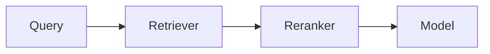

# Style Guide

Consistency is a feature. These conventions keep MAP readable and comparable across
hundreds of patterns.

## Voice & tone

- Write for a **working engineer** making a decision under time pressure.
- Be **direct and concrete.** Prefer "use this when X" over "this can be useful."
- Be **neutral and honest.** No hype, no vendor promotion in the pattern body.
- Use **second person** ("you") for guidance; **present tense** for behavior.

## Structure

- Keep every H2 section from the [pattern template](../patterns/_template/PATTERN_TEMPLATE.md), in order.
- One pattern per folder; the article lives in `README.md`.
- Short paragraphs (2–4 sentences). Bullets for lists of conditions or trade-offs.

## Naming

- **Pattern titles:** established, canonical names (e.g. "Reranking", "Parent-Child Retrieval").
- **Slugs / folders:** lowercase kebab-case, matching the roadmap (e.g. `hybrid-search`).
- **"Also known as":** list synonyms so search finds the pattern.

## Diagrams

- Prefer **Mermaid** — it renders directly on GitHub and stays diff-able.
- Keep diagrams focused on the pattern; omit incidental infrastructure.
- If you use an image, place it in the pattern's `assets/` folder and add alt text.

## Code

- Reference implementations are **minimal and framework-agnostic**. Illustrate the
  pattern, not a product.
- Prefer standard library / pseudocode. If a library is essential, keep it to one and
  say why.
- Code must run (or be clearly labeled pseudocode). Fuller runnable code goes in
  [`reference/`](../reference/).
- Include comments that explain the *why*.

## Links

- Cross-link related patterns with relative links.
- Cite **primary sources** in *References*; number them.
- Verify links (the link-check CI will catch broken ones).

## Markdown mechanics

- Use `##` for the main sections; don't skip heading levels.
- Wrap prose at a comfortable width; don't hard-wrap tables.
- Use fenced code blocks with a language tag.
- Use tables for trade-offs and comparisons.

## Inclusive, precise language

- Define acronyms on first use.
- Avoid idioms that don't translate; MAP aims to be globally readable and translatable.
