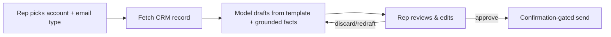

# Example — AI Email Assistant

> Generate customer emails from CRM data — grounded, human-approved, and editable before
> anything is sent.

## Project overview

A sales/success team wants to draft customer emails (follow-ups, renewals, onboarding)
using data already in the CRM (account, plan, recent activity). The AI drafts; a human
reviews, edits, and sends.

## Business problem

Reps spend hours writing routine emails. AI can draft them, but an email sent to a customer
is a commitment: a hallucinated discount, a wrong renewal date, or an off-tone message
damages the relationship. Speed can't come at the cost of correctness or control.

## Requirements

- **Grounded** responses — facts (plan, dates, usage) come from the CRM, not the model.
- **Human approval** — nothing sends without a person.
- **Editable** output — the draft is a starting point, fully editable.

## Constraints

- Customer-facing: tone and factual accuracy matter.
- CRM is the source of truth; the model must not invent account details.
- Reps aren't prompt engineers — the flow must be simple.

## Architectural decisions

| Decision | Choice | Why |
|----------|--------|-----|
| Get the facts right | **RAG** over CRM records (grounding) | Inject the specific account's real data; don't rely on model memory |
| Never auto-send | **Human-in-the-Loop Approval** | A person reviews and sends; AI only drafts |
| Keep control | Editable draft + **Confirmation-Gated Tools** | Sending is a gated action, not an autonomous one |
| Keep it factual | **Citation / Grounding** of key facts | Surface which CRM fields a claim came from |
| Consistent structure | **Structured Prompting** (templates per email type) | Predictable, on-brand drafts |

## Selected MAP patterns

- **Human-in-the-Loop Approval** — see [Agents](../../patterns/agents/).
- **Confirmation-Gated Tools**, **Tool Result Validation** — see [Tool Calling](../../patterns/tool-calling/).
- **RAG / grounding**, **Metadata Filtering** — see [Retrieval](../../patterns/retrieval/).
- **Structured Prompting** — see [Context Management](../../patterns/context/).
- **PII Redaction** in logs — see [Security](../../patterns/security/).

## Why these patterns

- **Grounding over generation.** The model writes prose; the *facts* (plan tier, renewal
  date, usage) are injected from the CRM so they're correct by construction.
- **Human approval is the safety pattern.** For irreversible, outward-facing actions
  (sending email to a customer), a human gate is the right control — the AI drafts, the
  human commits.
- **Editable by default.** Treat output as a draft, not an answer; the rep owns the final text.

## Rejected alternatives

- **Autonomous send.** Rejected: an email is an external, hard-to-reverse action; the blast
  radius of a bad draft is a damaged customer relationship. Gate it behind a human.
- **Generate from the model's general knowledge.** Rejected: it will invent plausible-but-
  wrong account facts. Ground every fact in the CRM.
- **One giant freeform prompt.** Rejected: inconsistent tone/structure; use templates per
  email type for predictability.

## Architecture

## Trade-offs to watch

- Human approval adds a step — that's the intended cost for an irreversible external action.
- Over time you may auto-approve *low-risk* templates; keep high-stakes emails gated. Decide
  with data from your [Evaluation](../../patterns/evaluation/) of draft quality.
