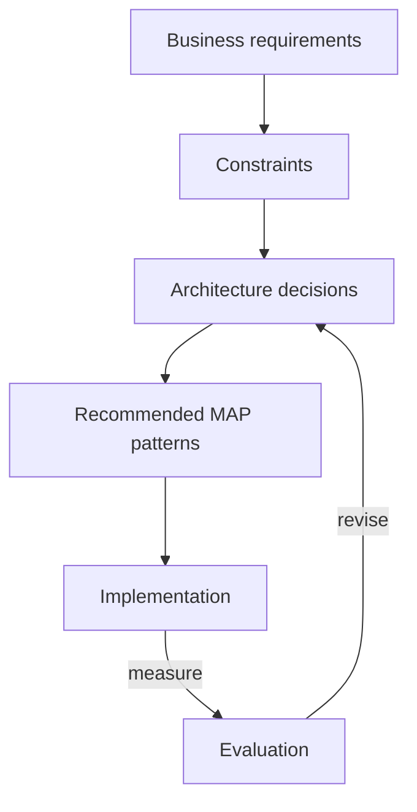

# Example — Starting a New AI Project (Architecture Review)

> How an architect uses MAP to go from business requirements to a pattern-based design —
> the meta-example.

## Purpose

The other examples show finished decisions. This one shows the **process**: how to walk
from requirements to a MAP-based architecture, so you can repeat it on your own project.

## The workflow

### 1. Business requirements

State what success looks like in the user's terms, not the model's. Examples:

- "Answers must cite a source." → grounding / citations.
- "Never mix customer data." → isolation.
- "Feels instant." → latency budget.
- "We can't retrain weekly." → retrieval over fine-tuning.

### 2. Constraints

Write down what limits the design: data sensitivity, budget, latency target, team skill,
existing systems, compliance. Constraints eliminate patterns faster than requirements
select them.

### 3. Architecture decisions

Turn each requirement + constraint into a decision, and record the trade-off. This is an
ADR. For each decision, name the **question**, the **chosen pattern**, and **why** — plus
what you rejected.

| Question | Typical MAP decision |
|----------|----------------------|
| Ground answers in our data? | RAG vs fine-tuning vs long-context |
| How to prepare documents? | [Chunking](../../patterns/retrieval/chunking/) strategy |
| How to keep data separate? | Tenant Isolation, Metadata Filtering |
| Can the AI act? | Tool Calling + Least-Privilege + (maybe) Human Approval |
| Is it fast/cheap enough? | Caching, Routing, Streaming |
| How do we know it works? | Golden Dataset, LLM-as-Judge |
| Can we see what happened? | Tracing, Cost Tracking, Audit Trails |

### 4. Recommended MAP patterns

Collect the chosen patterns into a coherent stack and check they compose (some patterns
are prerequisites for others; some conflict). Browse by category in the
[catalog](../../patterns/) and the [Roadmap](../../ROADMAP.md).

### 5. Implementation, then evaluation

Build the smallest version, then measure against a [Golden Dataset](../../patterns/evaluation/).
Let the evaluation feed back into the decisions — architecture is a loop, not a line.

## A worked mini-example

**Requirement:** internal Q&A bot over engineering wikis, cited, cheap.
**Constraints:** wikis change daily, small team, tight budget.

**Decisions:**

1. *Ground in wikis?* → **RAG** (daily changes rule out fine-tuning).
2. *Prepare docs?* → **[Chunking](../../patterns/retrieval/chunking/)** (structure-aware, headings preserved).
3. *Match quality?* → **Hybrid Search** (+ Reranking only if needed).
4. *Trust?* → **Citation Grounding**.
5. *Cost/latency?* → **Semantic Cache** + **Streaming**; **Model Routing** (small model
   for easy questions).
6. *Know it works?* → **Golden Dataset** + **LLM-as-Judge**.

**Rejected:** fine-tuning (stale, no citations), long-context stuffing (cost, dilution).

## Why this is the real value of MAP

The output isn't code — it's a **defensible set of decisions with named trade-offs**. Six
months later, anyone can read the ADR and understand *why* the system is shaped this way,
and MAP gives everyone the same vocabulary to discuss it.
