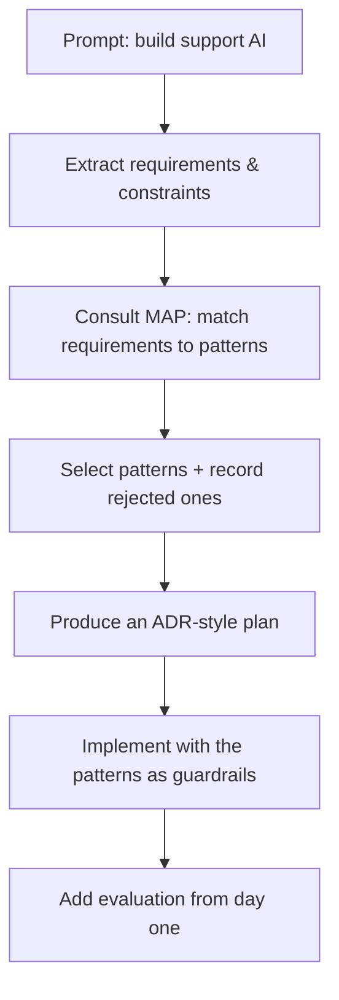

# Example — Claude Code (AI Coding Agent) Using MAP

> How an AI coding agent uses MAP to make and *justify* architectural decisions — the
> long-term vision.

## Purpose

MAP is written for humans and for AI coding agents (Claude Code, Cursor, Gemini CLI). This
example shows how an agent would consult MAP to turn a vague request into a defensible,
pattern-based plan — and to explain what it chose and rejected.

MAP does not replace the agent. It gives the agent **shared architectural context** so its
decisions are consistent, comparable, and reviewable.

## Example prompt

> "Build an AI customer support system following MAP patterns."

## How the agent uses MAP



1. **Extract** requirements and constraints from the request (accuracy, citations, fresh
   docs, latency, budget).
2. **Match** each to MAP patterns instead of reaching for a framework's defaults.
3. **Select** a coherent stack and **record what it rejected and why** — so a human can
   audit the reasoning.
4. **Implement** with the patterns as guardrails (e.g. "ground every fact", "gate external
   actions", "isolate tenants").

## What the agent selects (and why)

| Requirement | Selected pattern | Rejected | Why |
|-------------|------------------|----------|-----|
| Answer from current docs | **RAG** | Fine-tuning | Docs change; retrieval stays fresh and can cite |
| Precise, citable retrieval | [**Chunking**](../../patterns/retrieval/chunking/) | Whole-doc embedding | Granular, source-linked answers |
| Trust | **Citation Grounding** | Ungrounded generation | Every claim points to a source |
| Untrusted doc content | **Prompt Injection Defense** | Trusting content | Documents must not carry instructions |
| Latency & cost | **Semantic Cache**, **Streaming**, **Model Routing** | One big model per call | Cheap/fast for the common case |
| Confidence it works | **Golden Dataset**, **LLM-as-Judge** | Ship and hope | Measure quality; catch regressions |

## Why this matters

- **Consistency** — two agents (or the same agent twice) reach comparable designs because
  they reason from the same catalog, not from whatever framework is trending.
- **Explainability** — the agent's output includes *why* and *what it rejected*, which is
  exactly what a human reviewer needs to trust it.
- **Better context, not autopilot** — MAP narrows the decision space to sound patterns and
  their trade-offs; the agent (and the human) still decide.

## Future CLI direction

As the [MAP CLI](../../cli/) grows, an agent could pull structured pattern context directly:

```bash
map explain retrieval.chunking      # what the pattern is and when to use it
map prompt retrieval.chunking       # an implementation prompt for a coding agent
map recommend                       # patterns missing from the detected architecture
```

This turns MAP from documentation an agent *reads* into an architecture layer an agent
*queries* — the direction described in [`future/cli.md`](../../future/cli.md).

## The long-term vision

An AI agent that builds systems by composing named, well-understood patterns — and can
justify every choice — is more useful and more trustworthy than one that emits framework
boilerplate. MAP is the shared map both the human and the agent navigate by.
