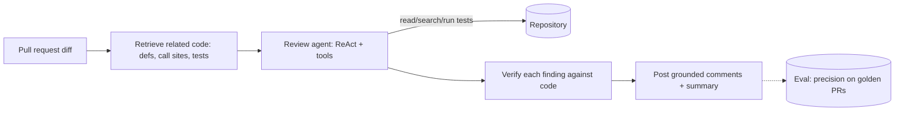

# Example — AI Code Review Agent

> An engineering team wants AI-assisted pull-request reviews that are useful, grounded in
> the actual codebase, and trusted by reviewers.

## Project overview

A team wants an agent that comments on pull requests: catches bugs, flags risky changes,
checks conventions, and summarizes the diff. It should complement human review, not replace
it, and never block on confident-but-wrong nitpicks.

## Business problem

Review is a bottleneck and quality varies. AI can triage and catch routine issues, but a
review tool that hallucinates problems ("this variable is undefined" when it isn't) trains
engineers to ignore it. Signal-to-noise is everything.

## Requirements

- Comments grounded in the **actual code and diff**, not the model's assumptions.
- Ability to pull relevant context (definitions, call sites, tests) beyond the diff.
- Measurable quality so the tool earns trust.
- Low hallucination — a wrong comment costs more than a missed one.

## Constraints

- Repos are large — the whole codebase won't fit in context.
- Reviews must be reasonably fast (attach to CI).
- False positives erode adoption quickly.

## Architectural decisions

| Decision | Choice | Why |
|----------|--------|-----|
| Give the model the right context | **Context Retrieval** over the repo | Pull definitions, call sites, and tests referenced by the diff |
| Let it inspect the code | **Tool Calling** (read file, search, run tests) | Ground claims by actually looking, not guessing |
| Keep it honest | **Hallucination Detection** / verification | Verify a flagged issue against the code before posting |
| Know if it's good | **Evaluation** (golden PRs, LLM-as-Judge) | Track precision of comments; block regressions |
| Scope the work | **Tool Budget** + diff-focused retrieval | Bound cost/latency per review |

## Selected MAP patterns

- **Tool Calling**, **Tool Result Validation**, **Tool Budget** — see [Tool Calling](../../patterns/tool-calling/).
- **Context Retrieval / Metadata Filtering** — see [Retrieval](../../patterns/retrieval/).
- **Reflection / Self-Critique**, **ReAct** — see [Agents](../../patterns/agents/).
- **Golden Dataset**, **LLM-as-Judge**, **Hallucination Detection** — see [Evaluation](../../patterns/evaluation/).

## Why these patterns

- **Retrieval + tools over "read the diff".** A diff without surrounding context produces
  wrong comments (a symbol may be defined elsewhere). Let the agent fetch definitions,
  call sites, and tests.
- **Verify before posting.** Each proposed issue is checked against the code (does the
  symbol really not exist? does the test really fail?) — the difference between a trusted
  tool and an ignored one.
- **Evaluate continuously.** A golden set of PRs with known issues measures precision/recall
  so you can tune toward high precision.

## Rejected alternatives

- **Feed the whole repo into a long-context prompt.** Rejected: too big, too costly, and
  relevance drops. Retrieve what the diff actually touches.
- **Comment straight from the diff with no verification.** Rejected: high false-positive
  rate; engineers mute the bot.
- **Fully autonomous blocking review.** Rejected: AI assists; humans decide. Post comments,
  don't gate merges on unverified findings.

## Architecture

## Trade-offs to watch

- Tune for **precision over recall** first — a few correct comments beat many noisy ones.
- **Tool budget** caps how deep the agent digs; too low and it misses context, too high and
  reviews get slow/expensive. Calibrate against the eval set.
