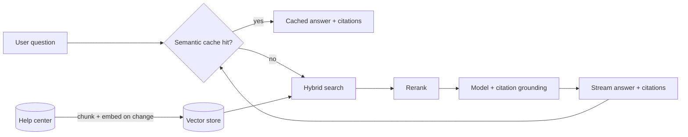

# Example — Customer Support Chatbot

> A startup wants an AI chatbot that answers customer questions from internal
> documentation, accurately and with citations.

## Project overview

A SaaS startup has a growing help center (product docs, FAQs, policy pages) that changes
every week. Support tickets repeat the same questions. They want a chatbot that answers
from the *current* documentation and links to the source, without inventing answers.

## Business problem

Support volume scales with customers; docs are good but hard to search. Customers want
instant, correct answers with a link they can trust. The team can't afford confident-but-
wrong answers that erode trust or create liability.

## Requirements

- Accurate answers grounded in the docs.
- **Citations** to the source passage.
- Low hallucination rate.
- Documents change frequently — answers must reflect the latest version.
- Low latency (chat feel, sub-second-ish first token).

## Constraints

- Small team, limited ML expertise — favor operationally simple patterns.
- Cost-sensitive — can't call the largest model on every keystroke.
- Content updates daily; re-training is out of the question.

## Architectural decisions

| Decision | Choice | Why |
|----------|--------|-----|
| Ground answers in docs | **RAG** (retrieval, not fine-tuning) | Docs change weekly; retrieval reflects updates instantly, fine-tuning can't |
| Prepare docs for retrieval | [**Chunking**](../../patterns/retrieval/chunking/) | Precise, citable retrieval of the right passage |
| Improve match quality | **Hybrid Search** + **Reranking** | Keyword + semantic catches exact terms and paraphrases; rerank lifts the best passage |
| Trust & citations | **Citation Grounding** | Force answers to cite retrieved chunks; refuse when unsupported |
| Latency & cost | **Semantic Cache** + **Streaming** | Cache repeated questions; stream tokens for perceived speed |
| Freshness | Incremental re-indexing on doc change | Keep the vector store in sync with the help center |

## Selected MAP patterns

- [Chunking](../../patterns/retrieval/chunking/) *(published)* — split docs into retrievable units.
- **RAG**, **Hybrid Search**, **Reranking**, **Semantic Cache** — see [Retrieval](../../patterns/retrieval/).
- **Citation Grounding**, **Prompt Injection Defense** — see [Security](../../patterns/security/).
- **Streaming** — see [Performance](../../patterns/performance/).

## Rejected alternatives

- **Fine-tuning a model on the docs.** Rejected: docs change weekly; you'd retrain
  constantly, and the model still couldn't cite a source or say "I don't know".
- **Stuffing all docs into a long-context prompt.** Rejected: too expensive per call, hits
  context limits as docs grow, and dilutes relevance (lost-in-the-middle).
- **Keyword search only.** Rejected: misses paraphrased questions; users don't phrase
  things like the docs.
- **No caching.** Rejected: the same top questions repeat all day; caching cuts cost and latency materially.

## Architecture

## Trade-offs to watch

- **Reranking** adds latency and cost; skip it for cached/simple queries, apply it when the
  first-pass results look weak.
- **Semantic cache** can serve a stale answer after a doc update — invalidate cache entries
  touched by re-indexing.
- **Citation grounding** trades a little coverage for a lot of trust: prefer "I couldn't
  find that" over a confident guess.
