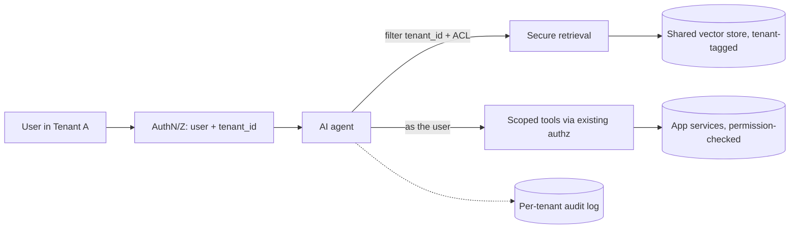

# Example — Multi-Tenant SaaS Adding AI

> An existing multi-tenant SaaS wants to add AI features without ever leaking data or
> permissions across tenants.

## Project overview

A B2B SaaS with thousands of tenants wants to add an in-app assistant that can answer
questions about a tenant's own data and take actions (create a ticket, update a record).
The platform already has tenants, users, roles, and permissions. AI must respect all of
it.

## Business problem

AI features are table stakes for competitiveness, but the platform's core promise is
isolation: tenant A must never see tenant B's data, and a user must never do via the AI
what they can't do in the UI. One leak is an existential incident.

## Requirements

- Every tenant is **isolated** — no cross-tenant data in retrieval or tools.
- Tools respect **user permissions** (the AI acts *as the user*, not as an admin).
- No cross-tenant leakage through prompts, caches, embeddings, or logs.

## Constraints

- Retrofit onto an existing permission model — don't reinvent authz.
- Shared infrastructure across tenants (multi-tenant DB, shared services).
- Must scale to many tenants without per-tenant hand-holding.

## Architectural decisions

| Decision | Choice | Why |
|----------|--------|-----|
| Scope all data access | **Tenant Isolation** | Every retrieval/tool call carries and enforces `tenant_id` |
| Constrain what the AI can do | **Least-Privilege Tool Access** (tool scoping) | Tools run with the *user's* permissions, not the model's |
| Keep retrieval in-bounds | **Secure Retrieval** (metadata filter on tenant + ACL) | Vectors are filtered by tenant and by document-level access |
| Prevent hijack via content | **Prompt Injection Defense** | Tenant data is untrusted; it can't escalate privileges |
| Don't leak via caches/logs | Tenant-scoped **Semantic Cache** & redacted **Observability** | Cache keys and logs are partitioned; PII redacted |

## Selected MAP patterns

- **Tenant Isolation**, **Least-Privilege Tool Access**, **Prompt Injection Defense**,
  **PII Redaction** — see [Security](../../patterns/security/).
- **Metadata Filtering** (secure retrieval) — see [Retrieval](../../patterns/retrieval/).
- **Confirmation-Gated Tools**, **Tool Result Validation** — see [Tool Calling](../../patterns/tool-calling/).
- **Audit Trails** — see [Observability](../../patterns/observability/).

## The core rule

> The AI is not a new principal. It acts **on behalf of the requesting user, within the
> requesting tenant**, and can do nothing the user couldn't do directly.

Everything else follows: retrieval is filtered by `tenant_id` *and* the user's ACLs; tools
are invoked through the same authorization layer as the UI; caches and logs are keyed by
tenant and scrubbed of PII.

## Rejected alternatives

- **A privileged AI service account** that can read everything and "be careful". Rejected:
  one prompt-injection or logic bug becomes a full cross-tenant breach. The AI must never
  hold more authority than the user.
- **A single global vector index without tenant filters.** Rejected: retrieval could surface
  another tenant's data; isolation can't be an afterthought in the ranking layer.
- **Trusting the model to "not use other tenants' data".** Rejected: security must be
  enforced by the system, not requested of the model.

## Architecture

## Trade-offs to watch

- Passing identity/tenant through every hop adds plumbing — but it's the whole point;
  don't shortcut it for the model's convenience.
- **Shared embeddings** are fine only if retrieval is always filtered; if in doubt, isolate
  indexes per tenant tier.
