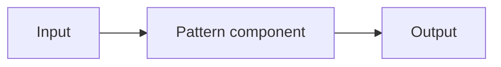

<!--
  MAP PATTERN TEMPLATE
  ────────────────────
  Copy this file to: patterns/<category>/<pattern-slug>/README.md
  (e.g. patterns/retrieval/reranking/README.md)

  • Keep every H2 heading below — reviewers rely on the consistent structure.
  • Delete these HTML comments and the italic guidance under each heading.
  • "Benchmarks" is the only optional section; keep the heading and write
    "Not yet benchmarked." if you have no data.
  • Read docs/pattern-anatomy.md and docs/style-guide.md before writing.
-->

# <Pattern Name>

> One-sentence definition of the pattern in plain language.

**Category:** <Retrieval | Memory | Agents | Security | Context | Evaluation | Performance | Routing | Tool Calling | Observability>
**Also known as:** <alternative names, or "—">
**Maturity:** <Established | Emerging | Experimental>

---

## Decision

*The 20-second summary so a reader knows whether to keep reading.*

**Use <Pattern> if:**

- ✅ <condition>
- ✅ <condition>

**Avoid <Pattern> if:**

- ❌ <condition — and what to use instead>
- ❌ <condition>

## MAP Score

*A 1–5 star rating per dimension. See [MAP Score](../../../map-score/SPEC.md). Higher is
better, except Complexity (lower is simpler).*

| Dimension | Score | |
|---|---|---|
| Complexity | ★★☆☆☆ | 2/5 |
| Latency | ★★★★★ | 5/5 |
| Cost | ★★★★★ | 5/5 |
| Accuracy Impact | ★★★★★ | 5/5 |
| Production Readiness | ★★★★★ | 5/5 |

## Problem

*What specific, concrete problem does this pattern solve? State it as the situation a
developer is in when they reach for this pattern. Two or three sentences.*

## Motivation

*Why does the naive approach fall short? Walk through the failure or friction that
motivates the pattern. A short scenario is ideal.*

## When to use

*Bullet the conditions under which this pattern is a good fit. Be concrete and honest.*

- …
- …

## When NOT to use

*Bullet the conditions under which this pattern is the wrong choice, and say what to
use instead. This section is as important as "When to use."*

- …
- …

## Architecture Diagram

*A diagram is required. Prefer a Mermaid diagram (renders on GitHub) or place an image
in an `assets/` folder next to this file.*



## Flow

*Numbered, step-by-step description of how data/control moves through the pattern.*

1. …
2. …
3. …

## Trade-offs

*The core of a MAP article. Summarize the key tensions — latency vs quality, cost vs
accuracy, complexity vs control. A table works well.*

| Dimension | Impact |
|-----------|--------|
| Latency | … |
| Cost | … |
| Complexity | … |
| Quality / Accuracy | … |

### Advantages

- …
- …

### Disadvantages

- …
- …

## Failure Modes & Anti-patterns

*Common mistakes that break this pattern in practice — the "don't do this" list. Very
practical; most docs omit it.*

- ❌ <common mistake and why it hurts>
- ❌ <common mistake>

## Reference Implementation

*A minimal, readable, framework-agnostic implementation that illustrates the idea.
Keep it small. Link to fuller code in `reference/python/…` or
`reference/typescript/…` if applicable.*

```python
# Pseudocode or minimal, dependency-light example.
```

## Production Variants

*How this pattern shows up in real systems — scaling considerations, common
modifications, and how libraries/vendors typically implement it (named neutrally).*

- **Variant A** — …
- **Variant B** — …

## Benchmarks (optional)

*Quantitative trade-offs where measurable: latency, cost, quality deltas, and the
setup used. If none, write: "Not yet benchmarked — contributions welcome."*

## Related Patterns

*Link to complementary, competing, or prerequisite MAP patterns.*

- [Related Pattern](../../<category>/<slug>/) — how it relates.

## References

*Papers, blog posts, docs, and talks. Prefer primary sources. Use a numbered list.*

1. …
2. …

---

<sub>Part of [MAP — Missing AI Patterns](../../../README.md). Contributions welcome — see [CONTRIBUTING.md](../../../CONTRIBUTING.md).</sub>
