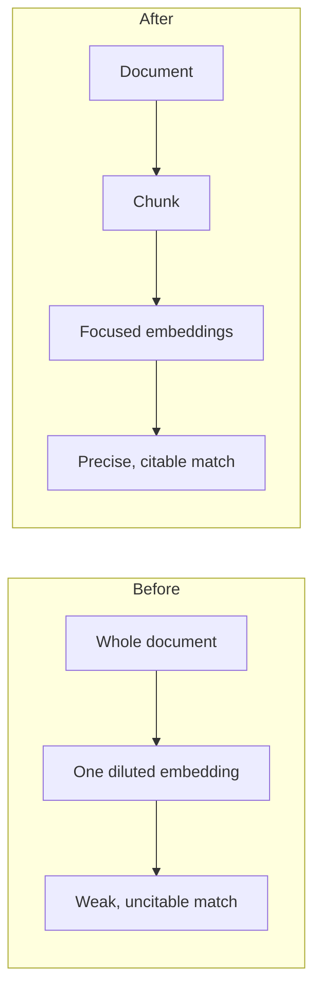
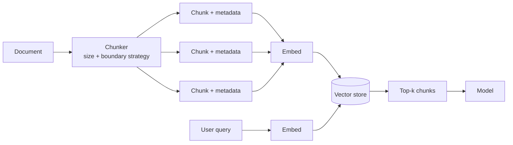
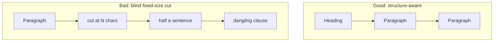
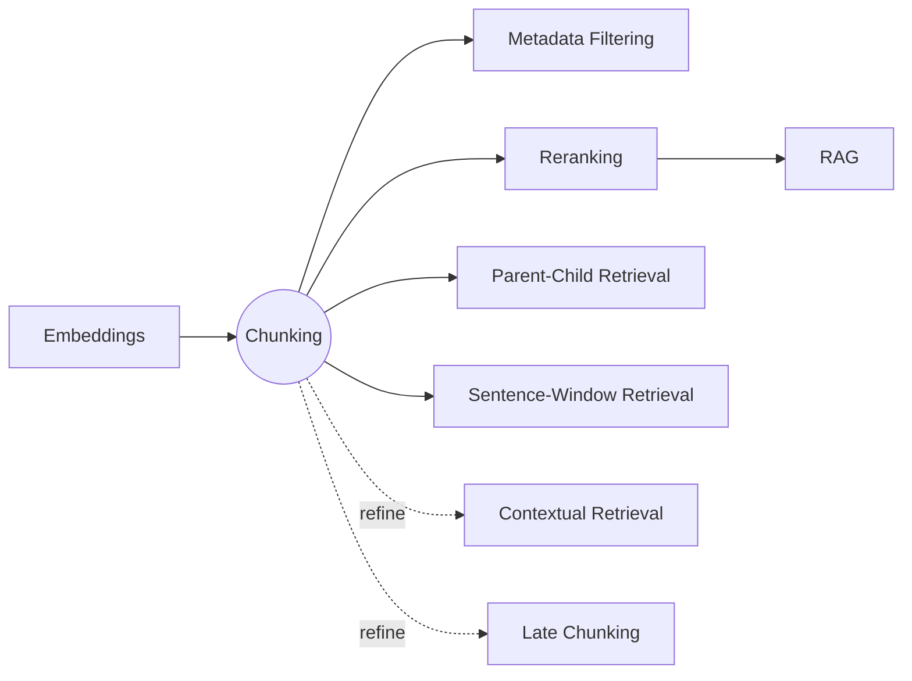

# Chunking

> Split documents into smaller, self-contained units so retrieval can find and return
> the right piece of context instead of a whole document.

**Category:** Retrieval
**Also known as:** Text splitting, Document segmentation
**Maturity:** Established

---

## Decision

**Use Chunking if:**

- ✅ your documents are longer than a paragraph or two
- ✅ you're doing semantic / RAG retrieval over them
- ✅ you need citable, passage-level answers

**Avoid Chunking if:**

- ❌ the unit is already right-sized (rows, FAQ pairs, short notes)
- ❌ the task needs the whole document at once (full-doc summarization)
- ❌ the data is tabular/relational (use structured filtering / SQL)

## MAP Score

| Dimension | Score | |
|---|---|---|
| Complexity | ★★☆☆☆ | 2/5 |
| Latency | ★★★★★ | 5/5 |
| Cost | ★★★★★ | 5/5 |
| Accuracy Impact | ★★★★★ | 5/5 |
| Production Readiness | ★★★★★ | 5/5 |

<sub>Higher is better, except **Complexity** (lower is simpler). See [MAP Score](../../../map-score/SPEC.md).</sub>

## Problem

You want a model to answer questions over a corpus that is far larger than its context
window (manuals, wikis, tickets, code). You can't put whole documents into every prompt,
and embedding a whole document into a single vector blurs everything it says into one
average. You need to break each document into units that are small enough to retrieve
precisely and embed faithfully, but large enough to still make sense on their own.

## Motivation

Say a 40-page handbook has one paragraph about refund deadlines. If you embed the whole
document as one vector, a query about "refund window" competes with 40 pages of unrelated
text and the match is weak. If instead you split the handbook into tiny 20-character
fragments, the phrase "refund window" might land in a fragment with no surrounding
context, so even when it's retrieved the model can't use it.

Chunking is the decision about *where to cut*. It sits upstream of embeddings and
retrieval, and it quietly caps the quality of everything downstream: a reranker or a
better model can't recover information that a bad split threw away. Get chunking wrong
and you get confident answers grounded in the wrong fragment.

**Before** (no chunking) vs **after** (chunked):



## When to use

- You're building **retrieval-augmented generation (RAG)** over documents longer than a
  paragraph or two.
- Your sources are **unstructured or semi-structured** text (prose, Markdown, HTML, code)
  that has internal structure you can exploit.
- You need **granular, cited retrieval** — pointing the user at the specific passage, not
  the whole file.
- Documents exceed the embedding model's effective input size, or embedding whole
  documents dilutes relevance.

## When NOT to use

- **The unit is already the right size.** Rows, FAQ Q&A pairs, product records, or short
  notes are self-contained — index them as-is; splitting only fragments them.
- **The task needs the whole document at once** (full-document summarization, contract
  review). Retrieve or pass whole documents instead; a long-context model may remove the
  need to split at all.
- **The data is tabular/relational.** Use structured filtering or SQL, not text chunking
  (see [Metadata Filtering](../)).
- You can fit the entire corpus in the context window cheaply — then skip retrieval
  altogether.

## Architecture Diagram



## Flow

1. **Load** the document and normalize it (strip boilerplate, keep useful structure like
   headings).
2. **Split** into chunks using a size target and a boundary strategy (see Production
   Variants). Optionally add **overlap** so context isn't lost at the seams.
3. **Attach metadata** to each chunk: source id, title, section/heading, position, and any
   filters you'll query by.
4. **Embed** each chunk and **index** it in a vector store alongside its metadata.
5. At query time, embed the query, retrieve the top-k chunks, and pass them to the model.

## Trade-offs

The central knob is **chunk size**, with **overlap** and **boundary strategy** close
behind.

| Dimension | Smaller chunks | Larger chunks |
|-----------|----------------|---------------|
| Retrieval precision | Higher (focused matches) | Lower (diluted vectors) |
| Context per chunk | Less (may lose meaning) | More (self-contained) |
| Chunks per doc / index size | More | Fewer |
| Tokens sent to the model | Fewer per chunk, but you may need more chunks | More per chunk |
| Risk of splitting a fact in half | Higher | Lower |

**Overlap** trades storage and redundancy for resilience: repeating a little text between
neighbors keeps facts that straddle a boundary intact, but inflates the index and can
return near-duplicate chunks. **Boundary strategy** trades implementation complexity for
semantic integrity: cutting on paragraph/section boundaries preserves meaning better than
cutting every N characters.

### Advantages

- Makes retrieval **precise** and answers **citable** to a specific passage.
- Lets large corpora fit a fixed embedding and context budget.
- Cheap and framework-agnostic; a strong baseline before fancier retrieval.

### Disadvantages

- A bad split **caps downstream quality** — rerankers and better models can't recover
  dropped context.
- Requires **tuning** (size, overlap, strategy) per corpus and embedding model.
- Fixed-size splitting can **cut sentences or facts in half**.
- Overlap and small chunks **inflate index size and cost**.

## Failure Modes & Anti-patterns

Common mistakes that quietly wreck retrieval quality:

- ❌ **Splitting by a fixed character count** as the only strategy — cuts words and facts in half.
- ❌ **No overlap** — a fact that straddles a boundary is lost from both chunks.
- ❌ **Ignoring headings / document structure** — throws away the cheapest signal you have.
- ❌ **Splitting code blocks by character count** — breaks functions and fenced blocks mid-way.
- ❌ **One chunk size for every corpus** — prose, Markdown, and code need different boundaries.
- ❌ **Tuning chunk size from a blog number** instead of measuring on your own corpus.

Prefer natural boundaries over arbitrary cuts:



## Reference Implementation

Minimal, dependency-free splitters. The recursive splitter prefers natural boundaries
(paragraphs, then lines, then spaces) and only falls back to a hard cut when a piece is
still too big. A fuller runnable version is in
[`reference/python/retrieval/chunking/`](../../../reference/python/retrieval/chunking/).

```python
def fixed_size_chunks(text: str, size: int = 800, overlap: int = 100) -> list[str]:
    """Split text into fixed-size character windows with overlap."""
    if size <= 0 or overlap < 0 or overlap >= size:
        raise ValueError("require size > 0 and 0 <= overlap < size")
    step = size - overlap
    return [text[i : i + size] for i in range(0, len(text), step) if text[i : i + size].strip()]


def recursive_chunks(text: str, size: int = 800, separators=("\n\n", "\n", " ")) -> list[str]:
    """Split on the coarsest separator that yields pieces <= size; hard-cut as a last resort."""
    if len(text) <= size:
        return [text] if text.strip() else []
    for sep in separators:
        if sep in text:
            parts, buf = [], ""
            for piece in text.split(sep):
                candidate = piece if not buf else buf + sep + piece
                if len(candidate) <= size:
                    buf = candidate
                else:
                    if buf.strip():
                        parts.append(buf)
                    buf = piece if len(piece) <= size else ""
                    if len(piece) > size:  # piece itself too big: recurse deeper
                        parts.extend(recursive_chunks(piece, size, separators[1:]))
            if buf.strip():
                parts.append(buf)
            return parts
    return fixed_size_chunks(text, size, overlap=0)  # no separators left
```

## Production Variants

- **Recursive character splitting** — the common default (LangChain's
  `RecursiveCharacterTextSplitter`, LlamaIndex): try paragraph, then line, then word
  boundaries. Good general baseline.
- **Token-aware splitting** — size by model *tokens* (e.g. via `tiktoken`) rather than
  characters, so chunks fit the embedding/context budget exactly.
- **Structure-aware splitting** — split on Markdown headings, HTML tags, or code
  syntax (functions/classes) to keep semantically whole units.
- **Sentence / semantic chunking** — group adjacent sentences and start a new chunk when
  the topic shifts (measured by embedding distance), producing meaning-aligned chunks.
- **Overlap & metadata tuning** — small overlap (5–15%) plus rich metadata (heading path,
  source, position) noticeably improves recall and lets you filter.
- **Decouple retrieval unit from context unit** — retrieve small, return large. See
  [Parent-Child Retrieval](../) and [Sentence-Window Retrieval](../).
- **Contextual chunking** — prepend a short document-level context to each chunk before
  embedding so isolated chunks stay interpretable (see [Contextual Retrieval](../) and
  [Late Chunking](../)).

## Benchmarks (optional)

Not yet benchmarked in MAP. The right chunk size is corpus- and embedding-model-specific;
measure on your own [Golden Dataset](../../evaluation/) rather than copying a number.
Contributions with a reproducible setup are welcome.

## Related Patterns

How Chunking sits in the wider map of retrieval patterns:



Planned MAP patterns that build on or pair with Chunking (see the [Roadmap](../../../ROADMAP.md)):

- **Parent-Child (Small-to-Big) Retrieval** — retrieve small chunks, return their larger parent.
- **Sentence-Window Retrieval** — retrieve a sentence, return a window around it.
- **Contextual Retrieval** / **Late Chunking** — keep chunks interpretable in isolation.
- **Reranking** — reorder retrieved chunks with a stronger model.
- **Metadata Filtering** — narrow retrieval using the metadata attached during chunking.

Browse the [Retrieval category](../) for the full list. The machine-readable edges live in
[`pattern.yaml`](pattern.yaml) (`related:`), which will one day power an interactive map of
the whole catalog.

<sub>Note: GitHub renders the graph but strips click events, so use the links above to
navigate.</sub>

## References

1. Lewis et al., "Retrieval-Augmented Generation for Knowledge-Intensive NLP Tasks" (2020). https://arxiv.org/abs/2005.11401
2. Liu et al., "Lost in the Middle: How Language Models Use Long Contexts" (2023). https://arxiv.org/abs/2307.03172
3. MAP pattern template and style guide — see [docs/pattern-anatomy.md](../../../docs/pattern-anatomy.md).

---

<sub>Part of [MAP — Missing AI Patterns](../../../README.md). Contributions welcome — see [CONTRIBUTING.md](../../../CONTRIBUTING.md).</sub>
